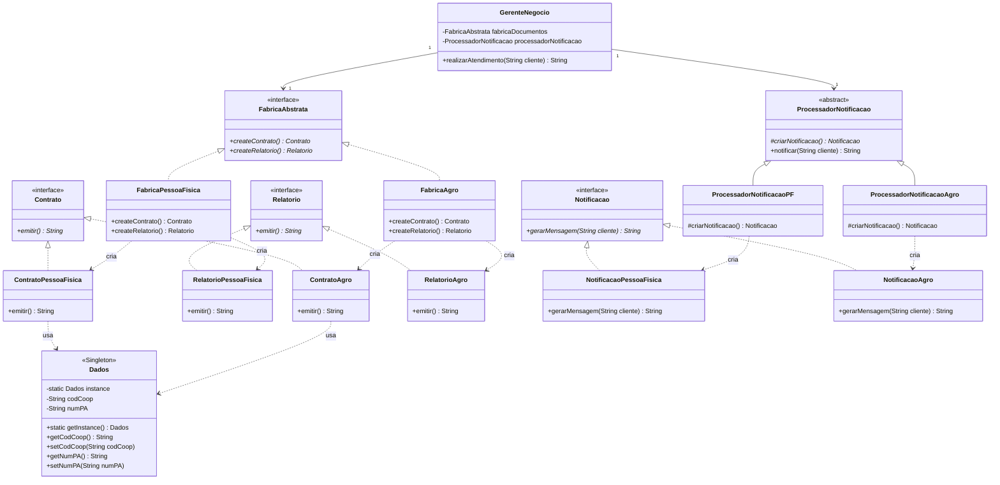

uniao dos padroes singleton, abstractfactory e factorymethod

diagrma:

```mermaid
classDiagram
    %% --- SINGLETON ---
    class Dados {
        <<Singleton>>
        -static Dados instance
        -String codCoop
        -String numPA
        +static getInstance() Dados
        +getCodCoop() String
        +setCodCoop(String codCoop)
        +getNumPA() String
        +setNumPA(String numPA)
    }

    %% --- ABSTRACT FACTORY: PRODUTOS ---
    class Contrato {
        <<interface>>
        +emitir()* String
    }
    class Relatorio {
        <<interface>>
        +emitir()* String
    }

    class ContratoPessoaFisica {
        +emitir() String
    }
    class RelatorioPessoaFisica {
        +emitir() String
    }

    class ContratoAgro {
        +emitir() String
    }
    class RelatorioAgro {
        +emitir() String
    }

    Contrato <|.. ContratoPessoaFisica
    Contrato <|.. ContratoAgro
    Relatorio <|.. RelatorioPessoaFisica
    Relatorio <|.. RelatorioAgro

    ContratoPessoaFisica ..> Dados : usa
    ContratoAgro ..> Dados : usa

    %% --- ABSTRACT FACTORY: FÁBRICAS ---
    class FabricaAbstrata {
        <<interface>>
        +createContrato()* Contrato
        +createRelatorio()* Relatorio
    }

    class FabricaPessoaFisica {
        +createContrato() Contrato
        +createRelatorio() Relatorio
    }

    class FabricaAgro {
        +createContrato() Contrato
        +createRelatorio() Relatorio
    }

    FabricaAbstrata <|.. FabricaPessoaFisica
    FabricaAbstrata <|.. FabricaAgro

    FabricaPessoaFisica ..> ContratoPessoaFisica : cria
    FabricaPessoaFisica ..> RelatorioPessoaFisica : cria
    FabricaAgro ..> ContratoAgro : cria
    FabricaAgro ..> RelatorioAgro : cria

    %% --- FACTORY METHOD: PRODUTO E CRIADORES ---
    class Notificacao {
        <<interface>>
        +gerarMensagem(String cliente)* String
    }

    class NotificacaoPessoaFisica {
        +gerarMensagem(String cliente) String
    }

    class NotificacaoAgro {
        +gerarMensagem(String cliente) String
    }

    Notificacao <|.. NotificacaoPessoaFisica
    Notificacao <|.. NotificacaoAgro

    class ProcessadorNotificacao {
        <<abstract>>
        #criarNotificacao()* Notificacao
        +notificar(String cliente) String
    }

    class ProcessadorNotificacaoPF {
        #criarNotificacao() Notificacao
    }

    class ProcessadorNotificacaoAgro {
        #criarNotificacao() Notificacao
    }

    ProcessadorNotificacao <|-- ProcessadorNotificacaoPF
    ProcessadorNotificacao <|-- ProcessadorNotificacaoAgro

    ProcessadorNotificacaoPF ..> NotificacaoPessoaFisica : cria
    ProcessadorNotificacaoAgro ..> NotificacaoAgro : cria

    %% --- CLIENTE INTEGRADOR ---
    class GerenteNegocio {
        -FabricaAbstrata fabricaDocumentos
        -ProcessadorNotificacao processadorNotificacao
        +realizarAtendimento(String cliente) String
    }

    GerenteNegocio "1" --> "1" FabricaAbstrata
    GerenteNegocio "1" --> "1" ProcessadorNotificacao
```
